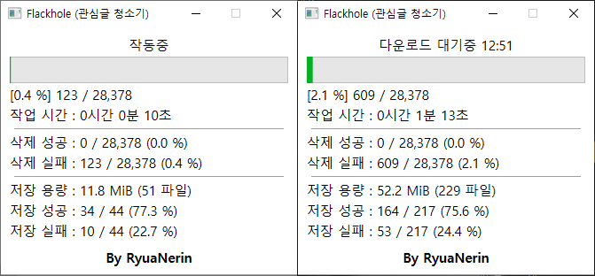

# Flackhole

- 트위터 관심글 미디어(사진/동영상) 저장 후 삭제 프로그램

- 3,200 개 이상의 관심글도 저장 및 삭제할 수 있습니다.

- 개발 환경 외의 환경에서는 정상적인 작동을 하지 않을 수 있습니다.
    - 개발 환경 : 윈도우 10, 버전 1909(OS 빌드 18363.836)

## 주의 사항

- 본 프로그램의 실행 파일과 소스코드는 [GNU General Public License v3.0](LICENSE.txt) 하에 배포됩니다.

- 본 프로그램을 사용함으로써 발생하는 모든 문제는 사용자 본인의 책임입니다.

## 참고 사항

- **프로그램 종료 후 다시 이어하기 지원되지 않습니다.**

- 작업이 멈춘 경우, 트위터 리밋으로 인한 현상입니다. 잠시 기다리면 다시 진행됩니다.

- 정지된 계정, 차단당한 계정의 트윗은 관심글에서 지워지지 않을 수 있습니다. (트위터 측 문제)

## 사용 방법

1. [트위터 웹페이지 → 설정 → 계정 → 내 트위터 데이터](https://twitter.com/settings/your_twitter_data) 로 이동합니다.

2. **내 트위터 데이터 다운로드** → **기록 파일 요청하기** 를 클릭합니다..

3. 내 트위터 데이터가 준비되었다는 메일 혹은 알람이 오면 해당 파일을 다운로드 합니다.
   - 계정의 트윗 수, 이미지 수, 관심글 수가 많아질 수록 오래 걸립니다.
   - 본 프로그램 개발자의 경우 약 2시간 정도 기다렸습니다.

4. [여기](https://github.com/RyuaNerin/Flackhole/releases/latest) 에서 최신 릴리즈를 다운로드 **(exe 파일)** 후 실행해주세요

5. 트위터 로그인을 진행해주세요.
    - **자주 로그인하면 한동안 로그인 불가 현상이 일어날 수 있습니다. (경험담)**

6. 다운로드 한 '내 트위터 데이터' 의 압축을 풀어 `data` 폴더 안 `like.js` 파일을 선택합니다..

7. 삭제만 할 것인지, 아니면 다운로드 하고 삭제할 것인지 선택합니다.

8. 저장할 폴더를 선택합니다. (다운로드 하고 삭제할 때만 나옴)

9. 작업이 진행됩니다. 오랜 시간이 소요될 수 있으니 느긋하게 기다려주세요.

    

    - **작동중** : 관심글 삭제 및 미디어 다운로드 중
    - **트윗 조회 대기중** : 관심글 삭제는 하지만, 미디어 다운로드 작업은 잠시 기다리는 중 (API 리밋)

    - **삭제 완료** : 관심글 삭제 성공 트윗 수
    - **삭제 실패** : 관심글 삭제 실패 트윗 수 **(트위터 측 문제)**

    - **저장 용량** : 저장한 파일의 전체 용량
    - **저장 완료** : 미디어 저장에 **성공**한 트윗 수
    - **저장 실패** : 미디어 저장에 **실패**한 트윗 수
